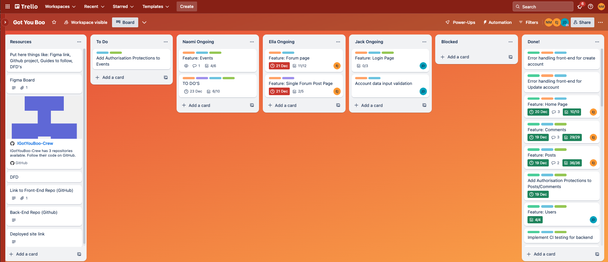

# I Got You, Boo

## Helpful quick links:

[Frontend Repo](https://github.com/IGotYouBoo-Crew/igyb-front-end)

[Backend Repo](https://github.com/IGotYouBoo-Crew/igyb-back-end)

[Assignment Part A README Repository](https://github.com/IGotYouBoo-Crew/T3A2-A)

[Trello Project Management Board](https://trello.com/b/y0rODp16/got-you-boo)

## Questions quick links:

[R1: Technologies used](#r1-at-a-minimum-use-the-following-technologies)

[R2: Write well designed code](#r2-write-well-designed-code-that)

[R3: Employ and utilise proper source control methodology](#r3-employ-and-utilise-proper-source-control-methodology-git)

[R4: Demonstrate your ability to work in a team](#r4-demonstrate-your-ability-to-work-in-a-team)

[R5: Produce a working application that meets client and user needs](#r5-produce-a-working-application-that-meets-client-and-user-needs)

[R6: Deploy the application to a cloud hosting service](#r6-deploy-the-application-to-a-cloud-hosting-service)

[R7: Produce an application with an intuitive user interface](#r7-produce-an-application-with-an-intuitive-user-interface)

[R8: Evidence of user testing](#r8-provides-evidence-of-user-testing)

[R9: A link (URL) to your deployed website](#r9-a-link-url-to-your-deployed-website)

[R10: A link to your GitHub repository (repo)](#r10-a-link-to-your-github-repository-repo)

# R1: At a minimum use the following technologies:
## - MongoDB
## - Express
## - React
## - Node

Yep, we did it guys! Our MERN app uses all those four building blocks and more 🙌🏽 

You can see it in action in both our [Frontend Repo](https://github.com/IGotYouBoo-Crew/igyb-front-end) and our [Backend Repo](https://github.com/IGotYouBoo-Crew/igyb-back-end).

Additional libraries that we incorporated across both front and backend for additional functionality such as date handling, routing, icon integration, and testing are detailed below:

IN ALPHABETICAL ORDER:
- **bcrypt** - everyone's favourite library for hashing passwords
- **cookie-parser** - this is the middleware that we chose to utilise for parsing cookies in Express
- **cors** - the sometimes troublesome, but necessary middleware for enabling Cross-Origin Resource Sharing (CORS)
- **dates-fns** and **dayjs** - both JavaScript libraries used for parsing, validating, manipulating, and formatting dates across the site
- **dot env** - the module that loads environment variables from our .env file
- **express** - because it's literally in the MERN name! This is the web framework for Node.js
- **helmet** - collection of middleware that allowed us to secure our app by setting HTTP headers
- **jest** - our chosen JavaScript testing framework. This was exceptional in helping find our testing coverage of code as well!
- **jsonwebtoken** - the library for generating and verifying JSON Web Tokens (JWTs), for security
- **mongoose** - again, M is in the MERN name! mongoose is the tool we used for object modelling
- **nodemon** - So. Helpful. This here is a tool that helped us by automatically restarting the app (as it's a Node application) when file changes in the directory were detected
- **react-icons** - a big, beautiful collection of React icons that were perfect for IGYB. This is where we got our icons for everything from the phone and email for our Contact Page, to the pencil on editable fields, or arrows on buttons to view more posts.
- **react-router-dom** - the good old standard routing library for a lot of React apps (if it ain't broke, don't fix it!). This was easy to integrate, and we were all familiar with it, so made sense to utilise for enabling navigation.
- **react-tailwindcss-datepicker** - this was a nightmare to work with intially, as it's typically a date *range* picker. In order to select just a single date and shoot that through to the backend took a little tweaking, as did being able to view the pop up calendar in different screensizes, as forms were in modals - which cuts overflow! 
- **supertest** and **supertest-session** - these libraries were used for testing HTTP assertions, and managing the sessions in supertest

 

# R2: Write well designed code that:
## - Separates the program into modules that each deal with one particular focus, or concern
## - Demonstrates DRY (Don’t Repeat Yourself) coding principles
## - Uses appropriate libraries
## - Demonstrates good code flow control for user stories
## - Applies Object Oriented (OO) principles/patterns
## - Uses appropriate data structures

We learned that full stack projects have loooots of files - even files that are well organised and following a set pattern!

We also learned that while Tailwind is AMAZING to set formatting and styles inline, it doesn't always end up looking super DRY when similar objects are needing slightly different specs (which can't just be put into a custom class and passed across elements). Technically, it's still DRY - as you *aren't* able to repeat the bulk of those styles - it just doesn't look super slick.

TAILWIND IN USE, WITH DIFFERENT FORMATTING REQUIRED: 

TAILWIND CUSTOM STYLES: 

And honestly, using React made using libraries and packages, and overall code flow and object oriented patterns super easy!

We were able to set files out in bite sized chunks, and follow a pattern for building pages in different components and then bringing them all together as imports one after the other. 

The real beauty of this was that files weren't crazy large and hard to follow; they made sense, and tackling the overall project piece by piece like this worked like a charm.

More details on the libraries used is back in R1 - figured you probably wouldn't want to read it twice, so left it with 'technologies' question.
 

# R3: Employ and utilise proper source control methodology (git)

Goodness gracious, we went HARD on this one! 

As of the 17th December, our code frequency graphs show how dedicated we've been:

The approach we took was to stay away from anyone working in the **main branch**, in order to lessen any potential/accidental conflicts or overrides.

We each created our **own branches** off the main based on our individual focus/features. Within these branches, we would make our changes and commits.

When we were ready to merge into main, we'd **rebase our branch** first. This ensured that any pull requests that happened *while* we were working on our branch would automatically be incorporated in the merge, and no one accidentally 'undoes' any of the progress we had collectively been making.

Once this rebase was complete, we'd make a **pull request**. We decided to include a requirement for a second team member to approve any pull request: this way, it just covered our butts having a second set of eyes scanning over the additions and deletions that were being brought into the main code for additional peace of mind.

In order to flag with one another that there was a pull request waiting, we'd use the good old **pull-requests** channel in Discord:

 

# R4: Demonstrate your ability to work in a team:
## - Use a recognised project management methodology
## - Use a recognised task delegation methodology

Reflecting on the 4 Agile values, they served as the guiding principles for our team throughout the development of the I Got You, Boo (IGYB) website:

- Individuals and interactions over processes and tools
- Working software over comprehensive documentation
- Customer collaboration over contract negotiation
- Responding to change over following a project plan

Ella, Jack, and Naomi have successfully embodied these Agile values in our collaborative effort to develop the I Got You, Boo (IGYB) website.

We initiated our teamwork through a single long message thread on Discord, quickly realizing the depth and complexity of the assignment Focused conversations, channels for specific topics/features, threads to go into depth on different matters, even just a place to quickly share resources, applicable tutorials, and relevant links were crucial to this running smoothly. 

We stuck with Discord as a central 'communication hub', but instead of a single messy message thread, created a Discord Server which was honestly a monumental win for us.

The first value of Agile (being *Individuals and interactions over processes and tools*) was one that we really upheld well. Life has been crazy at moments for all of us this past month, so being flexible with each other and working together was key. We even had a timezone bot added, so that times for online meetings between the three of us would show in our local timezones (as all three of us were in different states!):

We had two categories in order to quickly separate conversations, with channels inside these, and threads for individual comments inside those!

- INFORMATION
    - notes-resources
    - resources
        - tutorials 
        - icons in use
    - tips-and-tricks
        - GitHub Desktop Rebasing
 

- TEXT CHANNELS
    - general
    - meeting-planning
    - off-topic
    - not-quite-stand-up
    - help-troubleshooting
        - It just won'd do anything ...
        - Any ideas on how to ...
        - CORS problem
        - Alrighty, I've got two issues here ...
        - I've created a custom error handler ...
        - What ended up being the fix for ...
    - pull-requests
        - Created Events page and the skeleton ...
        - PR for backend: additional fields ...
        - PR for frontend: updated form with ...
        - PR for backend: [Cookies added] ...
        - Backend pull20
        - Feature comments section by Ella ...
    - issues-to-fix
    - wouldnt-it-be-nice

Obviously, these are labelled sensibly so they're easily understood and we knew exactly where to post different comments based on needs/topic.

As we were at times simultaneously working in/on the same files, the **not-quite-stand-up** channel was to communicate exactly what we'd be doing and when, in order to lessen conflicts when eventually merging.

Admittedly, we often utilised the **VOICE CHANNEL Meeting Room**, where we could all be online and just chat to each other, and communicate there who would be doing what. When that was the case, posting in **not-quite-stand-up** would have ended up with unnecessary messages clogging the server, and we ended up finding a beautiful balance that worked for our team really well.

One of the busiest channels was **pull-requests**, where we would post each pull request for the branch we were finished with, in order to merge that work into the Main branch of the repository (either front or backend).

The visual task delegation we utilised was our [Trello board 🗓](https://trello.com/b/y0rODp16/got-you-boo) from Part A of the assignment. It made sense to all of us to keep the same board and simply build upon it, to show a complete working history.

Originally, we agreed that organising the Trello board into a few specific cards with colour coded labels made the most sense and would be easy to follow. Luckily, the cards were able to remain the same:

CARDS:
- Resources
- To Do
- Naomi Ongoing
- Ella Ongoing
- Jack Ongoing
- Done!
- Blocked

However, we did build up our labels from the beginning in order to better track workload:

ORIGINAL LABELS:
- Set up 
- Planning 
- In Progress 

ADDITIONAL LABELS:
- Done! 
- HELP PLEASE 
- Front-End 
- Back-End 
- Coding 
- Level: EASY-PEASY 
- Level: MEDIUM RARE 
- Level: BOSS 

*Note:* Naomi did create a 'Done!' label for a hot minute during Part A, but quickly realised this was redundant (beyond adding another colour to the mix for the fun of it) because the Trello board already included a 'Done!' card. **HOWEVER**, we all liked the satisfaction of labelling something *Done!* as well as moving it to the 'Done!' card, so we kept both for the extra little morale boost 😉

Within the 'bulkier' items on our cards, we could add descriptions of what was required, as well as due dates and checklists. Each of us had slightly different ways of approaching this, but across the board (pun intended), we had the overall same attitude and work put in. We found it fun to see how each other approached similar tasks with alternative spins, and learnt from each other along the way,

#  *NOTE: Need to add git to trello board and update screenshots before submission* 

We weren't about sticking to a rigid plan, because it wasn't realistic and didn't feel like 'us'. Instead, we found our process was about embracing change, learning, and refining based on insights gained through meetings, discussions and collaborative feedback.

With that said, the [Figma Wireframes](https://www.figma.com/file/ygmt0g4Y5Q87a7FHad6Xll/I-Got-You%2C-Boo?type=design&node-id=0-1&mode=design&t=SttEmwEa2vDQyqSZ-0) for our overall design and therefore game plan  of how to bring it to life were AMAZING!

By having those complete sketches - which looked more like screenshots of an already finished product! - we were able to tailor our code and not waste extra time figuring it out along the way, whilst remaining realistic with our abilities and keeping that fine balance of not biting off more than we could chew. These also meant that we could adapt the finished project as we brought the website together and fine tuned functionality, user experience and aesthetic.

WIREFRAMES FOR FORUM/POSTS: 

FINISHED DEPLOYED PAGES FOR FORUM/POSTS:

 

# R5: Produce a working application that meets client and user needs

We're very proud of the I Got You, Boo forum (as are DudeBros Inc. and our users!). 

The IGYB page can be found here: https://igotyouboo.netlify.app/

 

# R6: Deploy the application to a cloud hosting service

We've utilised Netlify for the front end, and Heroku for the back end - so hosted on both sides by cloud services and having a great time up here!

Netlify allowed us to set environment variables. Obviously, these are automatically hidden from GitHub repositories for security, so the ability to set them in Netlify without having to make them public ensured the site functioned as intended:

Netlify further has automatic testing built in, which blocked a merge request if the pull request didn't meet the required parameters. 

The beauty of this meant that once we had the site up and running, it has basically stayed that way ever since!

 

# R7: Produce an application with an intuitive user interface

 

# R8: Provides evidence of user testing:
## - In the development environment
## - In the production environment

Once the majority of our site was deployed and functional, we were able to cross reference with an easy-to-read production testing table (based on the *Revised User Stories* that were completed in Part A), and ensure that we covered all bases:

#  *ADD UPDATED/COMPLETE PRODUCTION TESTING TABLE BEFORE SUBMISSION* 

 

# R9: A link (URL) to your deployed website

You've got a few links to this already, but just making we tick the right boxes at this point!

Drumroll, please...

Link: https://igotyouboo.netlify.app/ 💛😉

 

# R10: A link to your GitHub repository (repo)
## Ensure the repo is accessible by your educators!

You got it, folks!

[Frontend Repository can be found here](https://github.com/IGotYouBoo-Crew/igyb-front-end)

[Backend Repository can be found here](https://github.com/IGotYouBoo-Crew/igyb-back-end)